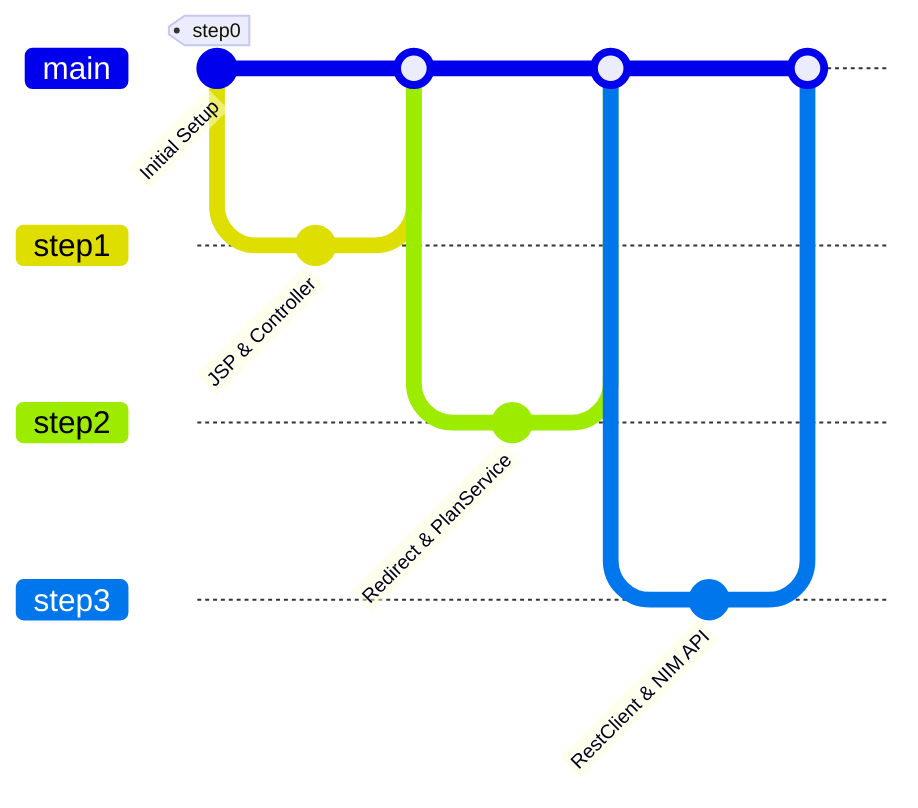

# NIM REST Client (AI 기반 학습 계획 생성 시스템)

Spring Boot 4와 Spring 7의 HTTP 클라이언트인 `RestClient`를 활용하여 NVIDIA NIM API(DeepSeek V4 Flash)와 연동하고, 사용자가 입력한 과목에 대한 2주 분량의 맞춤형 학습 계획을 자동 생성해주는 웹 애플리케이션입니다.

---

## 🛠️ Tech Stack & Badges


---

## 📂 Branch Roadmap & Architecture

본 프로젝트는 초보자가 점진적으로 학습할 수 있도록 단계별 브랜치 전략을 통해 단계적으로 구현되었습니다.



---

## 🌿 에센셜 요약 (Step-by-Step Summary)

각 단계별 핵심 내용 요약 및 상세 문서 링크입니다. (상세 링크에서 **초심자 비유**, **주니어용 원리/구조**, **면접 예상 질문**을 확인하실 수 있습니다.)

| 단계 | 브랜치 | 핵심 요약 | 상세 가이드 |
| :--- | :--- | :--- | :--- |
| **Step 0** | `step0` | Spring Boot 4 기초 빌드 환경 세팅 및 의존성 구성 | [상세 분석 문서 보기](./docs/step0.md) |
| **Step 1** | `step1` | JSP View Resolver 연동 및 Web MVC 기본 컨트롤러 매핑 | [상세 분석 문서 보기](./docs/step1.md) |
| **Step 2** | `step2` | POST 폼 추가, PRG(Post-Redirect-Get) 패턴 및 FlashAttributes 데이터 보존 적용 | [상세 분석 문서 보기](./docs/step2.md) |
| **Step 3** | `step3` | RestClient 설계 및 NVIDIA NIM API(DeepSeek V4) AI 실연동 | [상세 분석 문서 보기](./docs/step3.md) |

---

## 🏃 어떻게 실행하나요?

### 1. API 키 설정 (환경 변수)
NVIDIA NIM API를 사용하기 위해 [NVIDIA API Keys](https://build.nvidia.com/settings/api-keys)에서 발급받은 API 키를 로컬 시스템에 설정해야 합니다.

프로젝트 루트의 `.env` 파일에 발급받은 키를 작성해주세요. (또는 시스템 환경변수로 등록)
```bash
NIM_API_KEY=your_nvidia_nim_api_key_here
```

### 2. IntelliJ IDEA를 통한 실행
1. IntelliJ IDEA에서 본 프로젝트를 오픈합니다.
2. `src/main/java/org/example/nimrestclient/NimRestClientApplication.java` 메인 클래스로 이동합니다.
3. `main` 메서드 좌측의 초록색 실행 버튼(▶)을 클릭하여 **'Run 'NimRestClientApplication''**을 통해 실행합니다.
   > ⚠️ **환경변수 설정 주의**
   >
   > IntelliJ에서 애플리케이션을 구동하기 전, 반드시 상단 실행 구성 설정(**Run/Debug Configurations**)의 **Environment variables** 필드에 `NIM_API_KEY` 환경변수와 값을 추가하거나 `EnvFile` 플러그인을 활성화하여 API 키 값을 주입해야 에러 없이 정상 연동됩니다.
4. 구동 완료 후 브라우저에서 `http://localhost:8080`에 접속하여 학습 계획 생성을 테스트합니다.

