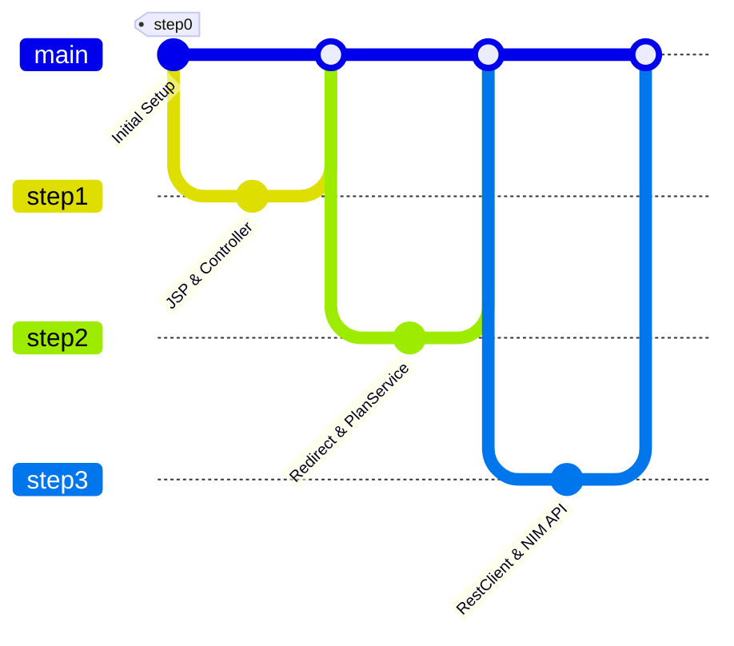
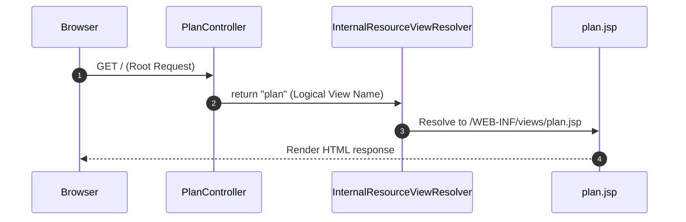
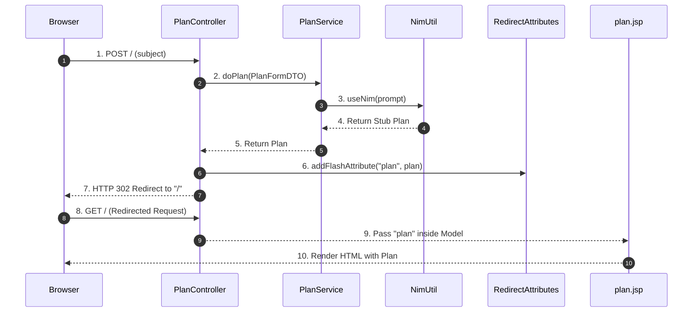
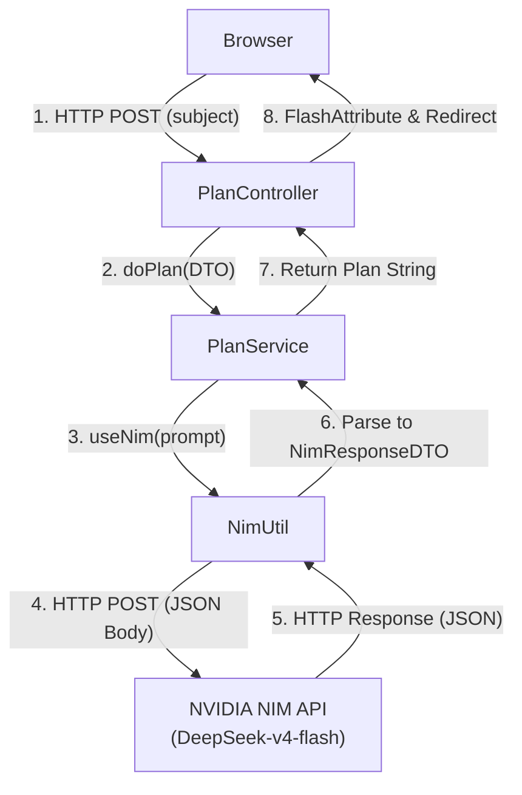

# NIM REST Client (AI 기반 학습 계획 생성 시스템)

Spring Boot 3와 Spring 6의 새로운 HTTP 클라이언트인 `RestClient`를 활용하여 NVIDIA NIM API(DeepSeek V4 Flash)와 연동하고, 사용자가 입력한 과목에 대한 2주 분량의 맞춤형 학습 계획을 자동 생성해주는 웹 애플리케이션입니다.

---

## 🛠️ Tech Stack & Badges


---

## 📂 Branch Roadmap & Architecture

프로젝트는 총 4단계(step0 ~ step3)에 걸쳐 점진적으로 구축되었습니다.



---

## 🌿 Branch-by-Branch Deep Dive

각 단계별 핵심 변경 사항과 설계 사상, 그리고 기술적 원리 설명입니다.

---

### 📍 Step 0 : 프로젝트 기초 설계 & 초기 구성
- **적용 브랜치**: `step0`
- **핵심 작업**: Spring Boot 프로젝트 스켈레톤 코드 구성 및 기본적인 의존성 설정

#### 💡 초심자를 위한 비유
> 빈 도화지와 미술 도구(붓, 물감 등)를 책상 위에 가지런히 정리해두는 단계입니다. 그림을 그리기 전에 어떤 도구들을 쓸지 미리 준비하는 과정과 같습니다.

#### 🛠️ 주니어를 위한 원리 및 구조 설명
Spring Boot 애플리케이션의 핵심 구동체인 `@SpringBootApplication` 어노테이션이 부착된 메인 클래스를 생성하고, 빌드 구성 파일(`pom.xml`)을 설계하여 프로젝트가 구동될 수 있는 최적의 뼈대를 만듭니다. 이 구성은 클래스패스 기반의 자동 설정 스캔(`@EnableAutoConfiguration`)과 컴포넌트 스캔(`@ComponentScan`)의 기준점이 됩니다.

#### 🙋 면접 대비 예상 질문 및 답변
* **Q. `@SpringBootApplication`의 세 가지 핵심 구성 어노테이션은 무엇인가요?**
  * **A.** `@SpringBootConfiguration`(설정 클래스 선언), `@EnableAutoConfiguration`(사전 정의된 의존성 기반의 자동 구성 빈 생성), `@ComponentScan`(현재 패키지 이하의 컴포넌트 스캔 및 빈 등록)입니다.

---

### 📍 Step 1 : View Resolver 및 Web Layer 구축
- **적용 브랜치**: `step1`
- **핵심 작업**: JSP 지원을 위한 내장 톰캣 설정(Jasper, JSTL) 및 View-Controller 매핑



#### 💡 초심자를 위한 비유
> 손님을 맞이하기 위해 예쁜 인테리어를 갖춘 가게 카운터(`plan.jsp`)를 열고, 손님을 자리로 안내할 친절한 도어맨 직원(`PlanController`)을 배치한 단계입니다.

#### 🛠️ 주니어를 위한 원리 및 구조 설명
Spring Boot는 기본적으로 JSP 대신 Thymeleaf 같은 템플릿 엔진을 권장하지만, 구형 레거시와의 호환이나 특정 환경 배포(예: WAR 패키징을 통한 클라우드 배포)를 위해 JSP를 사용할 수 있습니다.
* **Jasper & JSTL**: JSP 템플릿 컴파일을 위한 `tomcat-embed-jasper`와 JSP 표준 태그 라이브러리(`jakarta.servlet.jsp.jstl`)를 추가했습니다.
* **View Resolver 접두사/접미사**: `application.properties` 설정을 통해 컨트롤러가 반환하는 논리적 뷰 네임(예: `plan`)을 실제 물리적 경로(`/WEB-INF/views/plan.jsp`)로 연결합니다.

#### 🙋 면접 대비 예상 질문 및 답변
* **Q. Spring Boot에서 JSP 사용 시 WAR 패키징을 권장하는 이유는 무엇인가요?**
  * **A.** 내장 톰캣 구동 방식에서 일반적인 JAR 패키징은 표준 JSP 서블릿 컨테이너 규격을 완벽하게 충족하지 못해 JSP 파일 탐색 및 컴파일 에러가 발생할 수 있습니다. 따라서 웹 아카이브 규격을 따르는 WAR 패키징을 사용하여 리소스를 고정된 경로에 밀어 넣어야 정상 작동합니다.

---

### 📍 Step 2 : PRG 패턴 적용 및 비즈니스 레이어 확장
- **적용 브랜치**: `step2`
- **핵심 작업**: POST 폼 생성, PRG(Post-Redirect-Get) 패턴 구현, `RedirectAttributes` 사용 및 비즈니스 서비스(`PlanService`) 추가



#### 💡 초심자를 위한 비유
> 손님이 계산대에서 주문서(POST)를 작성하면, 직원이 이를 주방(`PlanService`)으로 넘긴 뒤 손님에게 대기표(`FlashAttribute`)를 쥐어주고 대기석으로 리다이렉트(Redirect)시킵니다. 대기석에 앉은 손님은 대기표를 내고 완성된 음식(`plan`)을 받습니다.

#### 🛠️ 주니어를 위한 원리 및 구조 설명
* **PRG 패턴**: 사용자가 폼 제출(POST) 후 새로고침(`F5`)을 누르면 이전 POST 요청이 중복으로 발생하게 됩니다. 이를 해결하기 위해 POST 요청의 응답으로 바로 화면을 렌더링하지 않고, 브라우저를 다른 GET 주소로 리다이렉트(`redirect:/`)시킵니다.
* **FlashAttributes**: 리다이렉트가 발생하면 브라우저는 완전히 새로운 HTTP 요청을 전송하게 되어 이전 요청의 Model 데이터가 유실됩니다. `RedirectAttributes.addFlashAttribute`는 내부적으로 **HTTP 세션(Session)**을 임시로 활용하여 데이터를 전달하며, 다음 요청에서 한 번만 읽힌 뒤 즉시 세션에서 소멸하는 불변 데이터 전달 매커니즘을 제공합니다.

#### 🙋 면접 대비 예상 질문 및 답변
* **Q. `RedirectAttributes`의 `addAttribute`와 `addFlashAttribute`의 차이점은 무엇인가요?**
  * **A.** `addAttribute`는 리다이렉트 URL의 쿼리 스트링 파라미터(예: `?name=value`) 형태로 전달하며 브라우저 주소창에 노출됩니다. 반면 `addFlashAttribute`는 데이터를 HTTP 세션에 잠시 임시 보관한 뒤 리다이렉트된 화면에서 꺼내어 사용하고 자동으로 소멸시켜 주소창에 정보가 노출되지 않고 대용량 객체도 전달할 수 있습니다.

---

### 📍 Step 3 : RestClient 및 NVIDIA NIM API 실연동
- **적용 브랜치**: `step3` (및 `step03`)
- **핵심 작업**: `RestClient` 빌더를 통한 외부 API 연결 설정, 환경변수(`NIM_API_KEY`) 연동, OpenAI 규격 Request/Response DTO 설계 및 외부 LLM 호출 연동



#### 💡 초심자를 위한 비유
> 주방 직원(`PlanService`)이 요리를 완성하기 위해, 검증된 대가(`NVIDIA NIM API`)에게 직접 전화를 걸어 조리법을 물어보는 단계입니다. 전화를 걸 때는 신원을 증명하는 비밀 번호(`NIM_API_KEY`)를 입력하고, 상대방이 이해할 수 있는 공통된 서류 양식(`DTO`)을 주고받습니다.

#### 🛠️ 주니어를 위한 원리 및 구조 설명
* **RestClient**: Spring Framework 6.1 / Spring Boot 3.2부터 제공되는 새로운 동기식 HTTP 클라이언트입니다. 기존의 가독성이 떨어지는 `RestTemplate`을 대체하며, 빌더 패던과 유려한 Fluent API 방식을 제공합니다.
* **DeepSeek V4 Flash API 연동**: API 키값 노출을 피하기 위해 시스템 환경변수 `NIM_API_KEY`를 주입받아 사용하며, 엔드포인트 `https://integrate.api.nvidia.com/v1/chat/completions`로 HTTP POST 요청을 보냅니다.
* **Jackson 직렬화/역직렬화 & DTO**: Record 형태로 생성된 `NimRequestDTO`와 `NimResponseDTO`를 활용해 API 통신 시 JSON Body 데이터를 안전하게 매핑합니다.

#### 🙋 면접 대비 예상 질문 및 답변
* **Q. `RestTemplate` 대비 `RestClient`의 대표적인 장점은 무엇인가요?**
  * **A.** `RestClient`는 Fluent API 스타일을 채택하여 코드가 훨씬 깔끔하고 직관적입니다. 또한, 비동기 처리에 주로 쓰이던 `WebClient`와 인터페이스가 매우 유사하여 개발자 경험(Developer Experience)이 통일된다는 이점도 제공합니다.
* **Q. 외부 Rest API 통신 시 DTO를 `record` 타입으로 설계했을 때 얻는 이점은 무엇인가요?**
  * **A.** Java `record`는 변경 불가능한(immutable) 데이터 객체를 표현하기에 최적입니다. 생성자, `getter`, `equals()`, `hashCode()`, `toString()` 등의 코드가 컴파일 타임에 자동으로 생성되어 군더더기 없는 클린한 DTO 아키텍처를 구현할 수 있습니다.

---

## 🏃 어떻게 실행하나요?

### 1. API 키 설정 (환경 변수)
NVIDIA NIM API를 사용하기 위해 [NVIDIA API Keys](https://build.nvidia.com/settings/api-keys)에서 발급받은 API 키를 로컬 시스템에 설정해야 합니다.

프로젝트 루트의 `.env` 파일에 발급받은 키를 작성해주세요. (또는 시스템 환경변수로 등록)
```bash
NIM_API_KEY=your_nvidia_nim_api_key_here
```

### 2. 프로젝트 빌드 및 실행
```bash
./mvnw spring-boot:run
```
이후 브라우저에서 `http://localhost:8080`에 접속하여 학습 계획 생성을 테스트해보실 수 있습니다.
