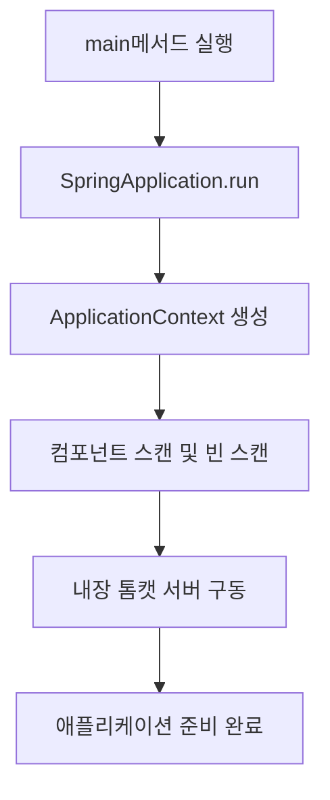

# 📍 Step 0 : 프로젝트 기초 설계 & 초기 구성

Step 0에서는 Spring Boot 3 애플리케이션의 구동을 위한 기초 뼈대(Skeleton)를 구성하고, 기본적인 의존성(Dependencies) 및 빌드 환경을 설정합니다.

---

## 💡 초심자를 위한 비유
> **"빈 도화지와 물감, 붓을 책상 위에 세팅하기"**
>
> 멋진 그림(웹 서비스)을 그리기 전에 가장 먼저 해야 할 일은 무엇일까요? 그림을 그릴 널찍한 테이블을 닦고, 빈 도화지를 올려두며, 붓과 물감 통을 준비하는 것입니다. Step 0은 코드를 작성하기 전에 개발 도구(Java 17)와 개발 프레임워크(Spring Boot)를 준비하여 언제든 코딩을 시작할 수 있는 최적의 환경을 세팅하는 단계입니다.

---

## 🛠️ 주니어를 위한 원리 및 구조 설명

### 1. Spring Boot의 구동 원리 및 초기 진입점
Spring Boot 애플리케이션은 메인 클래스 상단의 `@SpringBootApplication` 어노테이션을 기점으로 자동 설정 및 컴포넌트 스캔을 수행합니다.

### 2. `@SpringBootApplication` 구성 요소
이 어노테이션은 실질적으로 아래 세 가지 핵심 어노테이션의 조합입니다:

| 어노테이션 | 설명 |
| :--- | :--- |
| **`@SpringBootConfiguration`** | 애플리케이션의 설정을 담당하는 클래스임을 나타내며, 기존 Spring의 `@Configuration`과 동일한 역할을 합니다. |
| **`@EnableAutoConfiguration`** | `spring-boot-autoconfigure` 모듈에 정의된 자동 설정 규칙을 바탕으로, 클래스패스에 추가된 라이브러리(의존성)를 분석해 필요한 Bean을 컨테이너에 자동으로 등록합니다. |
| **`@ComponentScan`** | 현재 패키지 및 하위 패키지를 탐색하여 `@Component`, `@Service`, `@Repository`, `@Controller` 등이 붙은 클래스들을 빈으로 등록합니다. |

---

## 🙋 면접 대비 예상 질문 및 답변

### Q1. Spring Boot와 Spring Framework의 핵심적인 차이점은 무엇인가요?
* **A.** 가장 큰 차이점은 **`Auto Configuration` (자동 설정)**과 **`Embedded Server` (내장 서블릿 컨테이너)** 지원입니다.
  * 기존 Spring Framework는 XML이나 Java Config 클래스를 통해 개발자가 트랜잭션, 데이터베이스 연결, 뷰 리졸버 등을 일일이 수동 설정해야 했습니다.
  * 반면 Spring Boot는 `spring-boot-starter-*` 의존성만 추가하면 자주 쓰는 설정들을 내장 엔진이 클래스패스 분석을 통해 자동으로 처리해 줍니다. 또한 Tomcat이 내장되어 있어 별도의 WAS를 설치/설정할 필요 없이 단독 실행 가능한 JAR/WAR를 생성할 수 있습니다.

### Q2. Spring Boot 초기 구동 속도를 높이기 위한 최적화 기법에는 무엇이 있나요?
* **A.** 다음과 같은 기법들이 주로 사용됩니다:
  1. **`Lazy Initialization` (지연 초기화)**: 애플리케이션 시작 시 모든 빈을 생성하지 않고, 실제 빈이 요청될 때 생성하도록 설정합니다. (`spring.main.lazy-initialization=true`)
  2. **컴포넌트 스캔 범위 제한**: `@ComponentScan` 패키지 범위를 최소화하여 구동 시 클래스 탐색 오버헤드를 낮춥니다.
  3. **JVM 튜닝**: 불필요한 클래스 로딩을 막기 위해 `-XX:TieredStopAtLevel=1` 옵션을 부여하여 개발 단계의 구동 속도를 단축할 수 있습니다.
