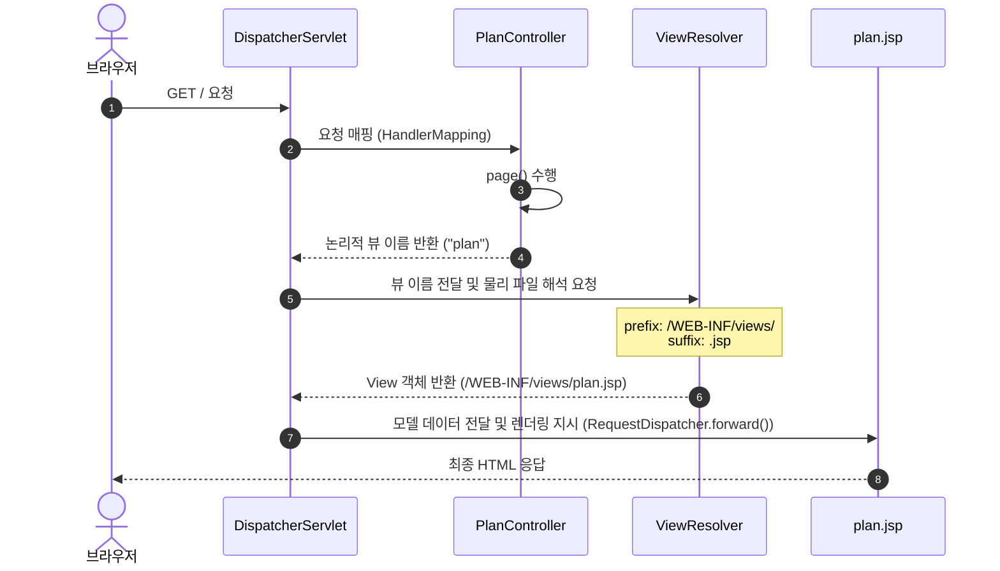

# 📍 Step 1 : View Resolver 및 Web Layer 구축


Step 1에서는 사용자가 브라우저를 통해 접속할 수 있는 웹 레이어(Web Layer)를 구축합니다. Spring MVC 아키텍처에 맞춰 JSP 뷰 템플릿 엔진을 연동하고 컨트롤러를 매핑합니다.

---

## 💡 초심자를 위한 비유
> **"가게 인테리어 완성하고 카운터 도어맨 배치하기"**
>
> 준비된 도화지 위에 손님들이 볼 수 있는 첫 화면(가게 프론트)을 그리는 작업입니다. 손님이 오면 메뉴판을 볼 수 있도록 테이블(`plan.jsp`)을 준비하고, 손님이 문을 열고 들어왔을 때 인사하며 테이블로 안내하는 도어맨 직원(`PlanController`)을 배치하는 것입니다. 도어맨은 손님의 주소(`/` 경로)를 확인한 뒤 알맞은 테이블 번호(`plan`)를 매칭해 줍니다.

---

## 🛠️ 주니어를 위한 원리 및 구조 설명

### 1. Spring MVC 요청 처리 생명주기 (JSP View Resolver)
Spring Web MVC에서 브라우저의 요청이 JSP 화면으로 변환되어 나가기까지의 아키텍처 구조입니다.



### 2. 의존성 구성 및 핵심 설정 코드
JSP 템플릿 렌더링을 위해서는 내장 서블릿 컨테이너(Embedded Tomcat)가 JSP를 컴파일할 수 있도록 엔진을 직접 탑재해 주어야 합니다.

#### 📄 `pom.xml` 의존성 및 패키징
Spring Boot 프로젝트에서 JSP를 처리할 수 있게 빌드 아키텍처를 변경합니다.
```xml
<!-- JSP를 패키징하기 위해 'war' 형태로 빌드 스펙 고정 -->
<packaging>war</packaging>

<dependencies>
    <!-- JSP 컴파일러 엔진인 Jasper 탑재 -->
    <dependency>
        <groupId>org.apache.tomcat.embed</groupId>
        <artifactId>tomcat-embed-jasper</artifactId>
    </dependency>
    <!-- Jakarta 규격을 따르는 JSTL API 및 구현체 추가 -->
    <dependency>
        <groupId>jakarta.servlet.jsp.jstl</groupId>
        <artifactId>jakarta.servlet.jsp.jstl-api</artifactId>
        <version>3.0.2</version>
    </dependency>
    <dependency>
        <groupId>org.glassfish.web</groupId>
        <artifactId>jakarta.servlet.jsp.jstl</artifactId>
        <version>3.0.1</version>
        <scope>runtime</scope>
    </dependency>
</dependencies>
```

#### 📄 `application.properties`
논리적 뷰를 물리 경로로 분석하기 위한 `InternalResourceViewResolver` 설정입니다.
```properties
spring.mvc.view.prefix=/WEB-INF/views/
spring.mvc.view.suffix=.jsp
```

---

## 🙋 면접 대비 예상 질문 및 답변

### Q1. Spring Boot는 왜 JSP 사용을 지양(Deprecate 수준으로 비권장)하고 Thymeleaf나 Mustache 사용을 권장하나요?
* **A.** 크게 세 가지 제약 조건과 아키텍처적인 성능 한계 때문입니다:
  1. **빌드 패키징의 한계**: JSP는 표준 WAS 구조를 요구하므로 전통적인 `JAR` 패키징으로 실행 시 내장 톰캣의 탐색 범위 제약으로 인해 동작하지 않는 경우가 많아 `WAR` 패키징이 강제됩니다.
  2. **의존성 오버헤드**: 서블릿이 직접 뷰를 처리하기 위해 무거운 `tomcat-embed-jasper` 엔진이 런타임에 올라가 메모리를 소모합니다.
  3. **비정형 렌더링**: 타 템플릿 엔진(Thymeleaf 등)과 달리 JSP는 컴파일되어 서블릿 클래스로 변환되는 단계를 거치므로 예외 추적 및 디버깅이 까다롭습니다.

### Q2. 뷰 리졸버(ViewResolver)가 물리 뷰 경로를 찾아갈 때 `/WEB-INF/` 하위 경로에 JSP를 두는 아키텍처적 이유는 무엇인가요?
* **A.** 클라이언트의 **직접적인 웹 자원 접근을 원천 차단**하여 보안성을 확보하기 위함입니다.
  * 브라우저가 직접 URL에 `http://localhost:8080/views/plan.jsp`를 입력해서 정적 파일로 다이렉트 접근하는 것을 막고, 반드시 `DispatcherServlet`과 `Controller`의 비즈니스 검증 및 인가 처리 흐름을 통과한 뒤 내부 포워딩(`RequestDispatcher.forward()`)을 통해서만 화면이 노출되도록 제약하는 설계 방식입니다.
