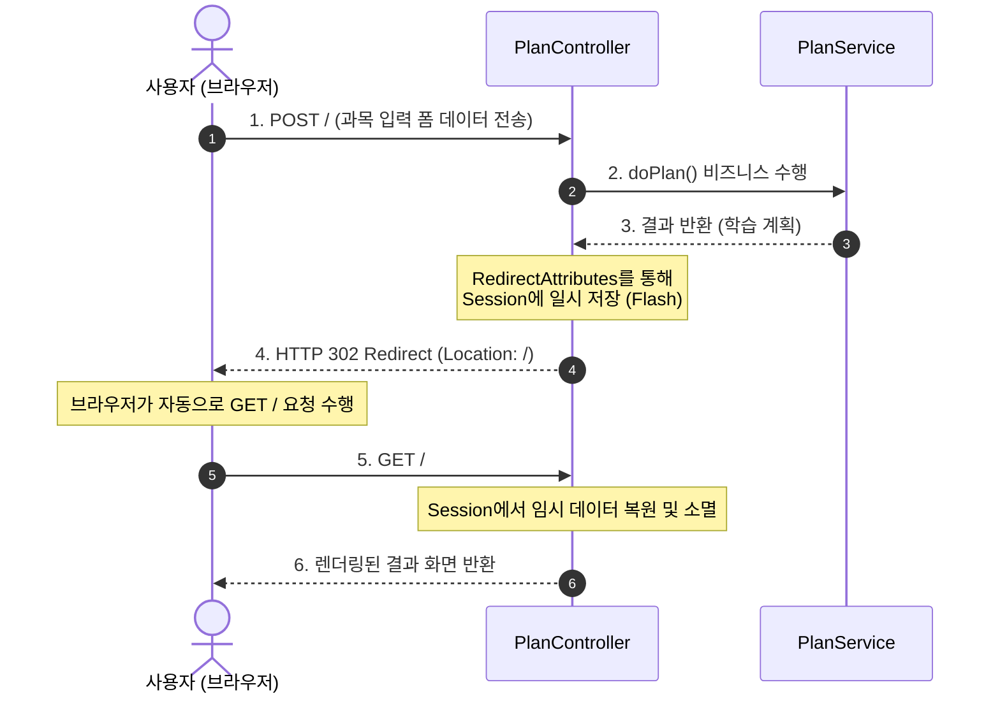
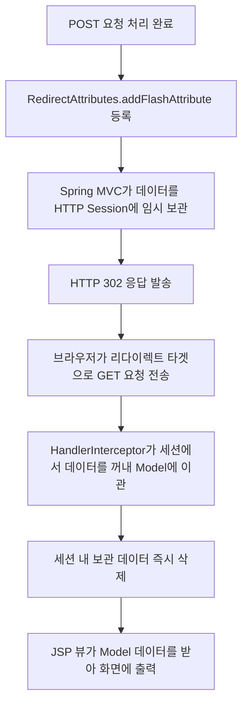

# 📍 Step 2 : PRG 패턴 적용 및 비즈니스 레이어 확장

Step 2에서는 사용자가 입력을 전송할 수 있는 폼(Form) 요소를 구현하고, 중복 서브밋을 차단하기 위한 설계 패턴인 **PRG 패턴**과 일회성 데이터를 전달하기 위한 **FlashAttributes** 아키텍처를 도입합니다. 또한 본격적으로 비즈니스 로직을 격리하기 위해 Service 컴포넌트를 분리합니다.

---

## 💡 초심자를 위한 비유
> **"주문서 접수 후 대기표를 주고 다른 대기실로 이동시키기"**
>
> 손님이 카운터에 주문서(POST 폼)를 내자마자 직원이 음식을 만들어 바로 건네주려고 하면, 뒤에 온 손님이 엉키거나 주문이 중복 접수되는 큰 혼란이 올 수 있습니다. 
> 
> 대신, 주문이 성공하면 직원(`Controller`)은 손님에게 일회용 대기 번호표(`FlashAttribute`)를 한 장 건네고, "저기 테이블 구역(GET 리다이렉트 주소)으로 가서 기다려 주세요"라며 자리 이동을 시킵니다. 손님은 지정된 테이블로 가서 대기 번호표를 반납하고 맛있는 요리(`plan` 데이터)를 무사히 전달받게 됩니다. 번호표는 음식을 받고 나면 즉시 쓰레기통에 폐기(세션에서 자동 소멸)됩니다.

---

## 🛠️ 주니어를 위한 원리 및 구조 설명

### 1. PRG (Post-Redirect-Get) 패턴의 필요성
사용자가 폼을 입력하고 제출한 뒤, 화면에서 브라우저 **새로고침(F5)** 버튼을 누르면 마지막으로 보냈던 HTTP POST 요청이 다시 서버로 날아갑니다. 결제 시스템이나 글 작성 페이지라면 심각한 중복 트랜잭션 장애를 일으킵니다.

이를 방지하기 위해 서버는 POST 요청에 대한 결과 페이지를 직접 HTML로 그리는 대신, **302 Redirect** 응답 코드를 주어 브라우저가 다른 GET URL로 강제 이동하도록 설계해야 합니다.

### 2. 세션을 활용한 FlashAttributes의 라이프사이클
리다이렉트를 처리하면 브라우저의 새로운 GET 요청으로 넘어가기 때문에 기존의 `Model` Map 객체에 담아두었던 정보는 완전히 증발합니다. 이를 위해 스프링은 `FlashMap` 아키텍처를 지원합니다.

---

## 🙋 면접 대비 예상 질문 및 답변

### Q1. `RedirectAttributes`의 두 가지 메서드 `addAttribute()`와 `addFlashAttribute()`의 동작 원리와 보안상 차이점을 설명해주세요.
* **A.** 두 방식은 데이터를 임시 저장하고 넘겨주는 위치가 다릅니다:
  1. **`addAttribute()`**:
     * **원리**: 리다이렉트 URL 뒤에 `Query String` (예: `?subject=Java`) 형태로 파라미터를 붙여 전송합니다.
     * **특징**: URL에 문자열 데이터가 그대로 노출되어 누구나 조작할 수 있으므로, 비즈니스에 중요하거나 크기가 큰 객체 데이터 전송에는 부적합합니다.
  2. **`addFlashAttribute()`**:
     * **원리**: HTTP **세션(Session)** 내부에 `FlashMap` 형태로 보관한 뒤 리다이렉트 요청에서 한 번 복원되면 즉시 파괴합니다.
     * **특징**: 데이터가 브라우저 URL 창에 전혀 노출되지 않고 자바 객체 타입을 통째로 넘겨줄 수 있어 안전하고 효율적입니다.

### Q2. 톰캣이 분산 서버 환경(Clustered Environment)일 때 `addFlashAttribute()`를 사용할 때 발생할 수 있는 잠재적 이슈와 대처 방안은 무엇인가요?
* **A.** `addFlashAttribute`는 기본적으로 WAS 내부 로컬 JVM 메모리의 **세션**에 의존합니다.
  * 만약 로드밸런서 뒤에 다수의 스프링 서버 노드가 돌고 있고 세션 공유(Session Clustering) 설정이 되어있지 않다면, POST 요청을 받아 세션에 데이터가 기록된 서버와, 리다이렉트되어 GET 요청을 수신하는 서버가 달라져 대기 번호표(Flash Data)가 누락되는 현상이 발생할 수 있습니다.
  * 이를 방지하기 위해 **Sticky Session** 방식을 지정하거나, **Spring Session Redis** 등을 도입하여 외부에 공통 세션 저장소를 두는 설계가 필요합니다.
