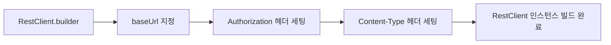
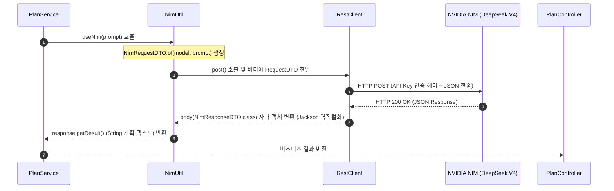

# 📍 Step 3 : RestClient 및 NVIDIA NIM API 실연동


Step 3에서는 Spring Boot 4의 현대적인 동기식 HTTP 클라이언트인 `RestClient`를 활용하고 외부 AI 연동 규격을 DTO로 설계하여, NVIDIA NIM API(DeepSeek V4 Flash)로부터 사용자가 입력한 과목에 대한 실제 AI 기반 맞춤형 학습 계획 데이터를 받아와 가공 및 서빙합니다.

---

## 💡 초심자를 위한 비유
> **"외부 최고급 프렌치 셰프에게 전화하여 진짜 레시피 물어보기"**
>
> 지금까지는 가게 내부 직원들이 가짜 모형 음식(Stub 데이터)만 주었지만, 이제는 진짜 요리를 해야 합니다. 우리 주방장(`PlanService`)은 더 이상 맛있는 계획을 세울 능력이 없어, 밖에서 맛집 소문이 파다한 대가 요리사(`NVIDIA NIM API`)에게 직접 전화를 걸어 2주 분량의 레시피를 물어보기로 합니다. 
> 
> 전화를 걸 때는 본인 가게가 맞는지 확인시켜 줄 비밀 신분 증명서(`NIM_API_KEY`)를 가방에서 꺼내고, 상대방이 알아들을 수 있도록 통일된 용지 스펙(`DTO`)에 주문 내용을 써서 팩스로 보내며, 답장 역시 규격화된 문서로 받아와서 알맹이(`choices.message.content`)만 쏙 빼서 손님에게 주는 단계입니다.

---

## 🛠️ 주니어를 위한 원리 및 구조 설명

### 1. Spring RestClient의 특징 및 도입 배경
Spring Framework 6.1부터 기존의 `RestTemplate`이 가진 구조적 복잡함을 보완하고, 유연하고 메서드 체이닝이 가능한 Fluent API 스타일의 인터페이스인 **`RestClient`**가 추가되었습니다.

* `RestTemplate`은 오버로딩된 메서드가 수십 개에 달해 인자값 매핑 시 실수할 확률이 컸지만, `RestClient`는 HTTP HTTP 메서드(`get()`, `post()`), URI 지정(`uri()`), 헤더 설정(`header()`), 바디 주입(`body()`) 및 응답 처리(`retrieve()`, `exchange()`) 단계를 빌더 패턴 형태로 명확히 체이닝할 수 있습니다.



### 2. NVIDIA NIM API 통신 및 DTO 역직렬화 흐름
외부 OpenAI 호환 Completion 엔드포인트 규격에 대응하기 위한 DTO 구조 및 바인딩 흐름입니다.



### 3. Record 기반 DTO 설계 코드

#### 📄 `NimRequestDTO.java`
NVIDIA NIM API에 메시지를 보낼 규격을 캡슐화합니다.
```java
public record NimRequestDTO(
    String model,
    List<Message> messages
) {
    public record Message(String role, String content) {}

    public static NimRequestDTO of(String model, String prompt) {
        return new NimRequestDTO(model, List.of(new Message("user", prompt)));
    }
}
```

#### 📄 `NimResponseDTO.java`
반환되는 복잡한 JSON 형식에서 필요한 텍스트만 추출하기 위한 역직렬화 타겟입니다.
```java
public record NimResponseDTO(
    List<Choice> choices
) {
    public record Choice(Message message) {}
    public record Message(String content) {}

    public String getResult() {
        return choices.get(0).message().content();
    }
}
```

---

## 🙋 면접 대비 예상 질문 및 답변

### Q1. RestTemplate, WebClient, 그리고 RestClient의 차이점과 프로젝트 성격에 따른 기술 선택 기준을 제시해 주세요.
* **A.** 
  | 구분 | RestTemplate | WebClient | RestClient |
  | :--- | :--- | :--- | :--- |
  | **동작 방식** | 동기 / 블로킹 | 동기 & 비동기 / 논블로킹 | 동기 / 블로킹 |
  | **스타일** | 템플릿 기반 (오버로딩 다수) | 리액티브 Fluent API | 동기형 Fluent API |
  | **라이브러리** | `spring-web` 기본 포함 | `spring-webflux` 추가 필요 | `spring-web` (Boot 3.2+/4.x) |

  * **선택 기준**:
    * 완전 비동기/논블로킹 환경이거나 처리량 극대화가 필요한 아키텍처라면 `WebClient`를 사용하는 것이 마땅합니다.
    * 하지만 단순 동기 호출 위주의 아키텍처라면 굳이 복잡한 `Reactive Streams` 의존성을 도입하지 않고, Spring의 최신 `RestClient`를 사용하는 것이 직관적이고 유지보수 비용을 낮추는 가장 좋은 대안이 됩니다.

### Q2. 외부 API 장애가 서비스 전체로 전파되는 현상을 방지하기 위한 Spring Boot 환경에서의 대비책은 무엇인가요?
* **A.** 서킷 브레이커(Circuit Breaker) 패턴을 도입해 타 시스템 장애 격리 정책을 수립해야 합니다.
  1. **`Resilience4j` 도입**: 외부 API 응답 지연이나 에러 발생률이 임계치를 초과할 시 서킷을 OPEN하여 외부 통신을 즉시 차단하고 사전에 정의된 로컬 예외(Fallback) 로직을 구동합니다.
  2. **커넥션/리드 타임아웃(Connection/Read Timeout) 설정**: `RestClient` 빌더 설정 시 반드시 리드 타임아웃을 짧게 지정하여 특정 API 먹통으로 인해 톰캣 스레드 풀 전체가 고갈되는 현상을 방지해야 합니다.
     ```java
     // 타임아웃 설정 예시
     JdkClientHttpRequestFactory factory = new JdkClientHttpRequestFactory();
     factory.setReadTimeout(Duration.ofSeconds(5)); // 최대 5초 대기
     ```
